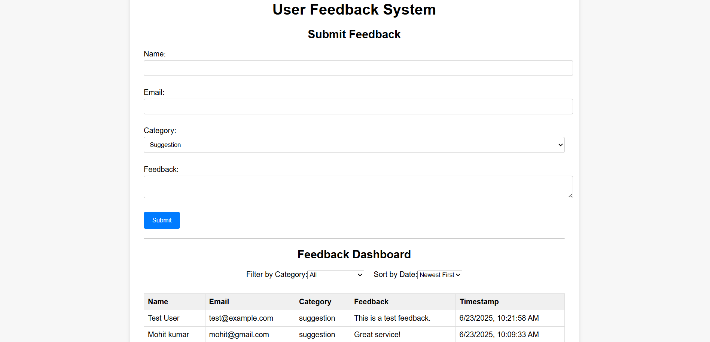

# User Feedback System

A full-stack user feedback system built with **React** (frontend), **Node.js/Express** (backend), and **MongoDB** (database).  
Users can submit feedback, which is stored securely and displayed in a dashboard with filtering and sorting options.

---

## Table of Contents

- [Project Overview](#project-overview)
- [Features](#features)
- [Architecture](#architecture)
- [Technologies Used](#technologies-used)
- [Folder Structure](#folder-structure)
- [Installation & Setup](#installation--setup)
- [Environment Variables](#environment-variables)
- [Running the Application](#running-the-application)
- [API Documentation](#api-documentation)
- [Screenshots](#screenshots)
- [Contributing](#contributing)
- [License](#license)

---

## Project Overview

This project allows users to submit feedback via a web form. Feedback is stored in a MongoDB database and can be viewed in a dashboard with filtering (by category) and sorting (by date). The system is scalable, responsive, and easy to maintain.

---

## Features

- **Submit Feedback:** Users can submit their name, email, feedback text, and category.
- **Dashboard:** View all feedback entries in a sortable and filterable table.
- **Filter:** Filter feedback by category (suggestion, bug, feature request).
- **Sort:** Sort feedback by newest or oldest.
- **Responsive Design:** Works on desktop and mobile devices.
- **API:** RESTful endpoints for feedback submission and retrieval.
- **Category Analytics:** (Optional) Get feedback counts by category.

---

## Architecture

- **Frontend:** React app for user interaction and dashboard.
- **Backend:** Node.js/Express REST API for handling feedback data.
- **Database:** MongoDB for storing feedback entries.

---

## Technologies Used

- **Frontend:** React, Axios, CSS
- **Backend:** Node.js, Express, CORS
- **Database:** MongoDB, Mongoose

---

## Folder Structure

```
project/
│
├── Backend/
│   ├── models/
│   │   └── Feedback.js
│   ├── routes/
│   │   └── feedback.js
│   ├── .env
│   ├── server.js
│   └── package.json
│
├── Frontend/
│   ├── public/
│   │   └── index.html
│   ├── src/
│   │   ├── api/
│   │   │   └── feedback.js
│   │   ├── components/
│   │   │   ├── FeedbackForm.jsx
│   │   │   └── FeedbackDashboard.jsx
│   │   ├── styles/
│   │   │   └── App.css
│   │   ├── App.jsx
│   │   └── index.js
│   └── package.json
│
├── README.md
└── ...
```

---

## Installation & Setup

### 1. Clone the Repository

```bash
git clone <repository-url>
cd project
```

### 2. Backend Setup

```bash
cd Backend
npm install
```

### 3. Frontend Setup

```bash
cd ../Frontend
npm install
```

---

## Environment Variables

Create a `.env` file in the `Backend` directory:

```
MONGODB_URI="your-mongodb-connection-string"
PORT=5000
```

---

## Running the Application

### 1. Start the Backend

```bash
cd Backend
npm start
```
or (if using nodemon)
```bash
npx nodemon server.js
```

### 2. Start the Frontend

Open a new terminal:

```bash
cd Frontend
npm start
```

The frontend will be available at [http://localhost:3000](http://localhost:3000).

---

## API Documentation

### **Base URL:** `http://localhost:5000`

---

### **POST /feedback**

**Description:** Submit user feedback.

- **Endpoint:** `/feedback`
- **Method:** POST
- **Request Body:**
    ```json
    {
      "name": "John Doe",
      "email": "john@example.com",
      "feedback": "Great app!",
      "category": "suggestion"
    }
    ```
- **Response:**
    ```json
    {
      "_id": "...",
      "name": "John Doe",
      "email": "john@example.com",
      "feedback": "Great app!",
      "category": "suggestion",
      "createdAt": "2024-06-24T12:34:56.789Z",
      "__v": 0
    }
    ```

---

### **GET /feedback**

**Description:** Retrieve feedback entries with filtering, sorting, and pagination.

- **Endpoint:** `/feedback`
- **Method:** GET
- **Query Parameters:**
    - `category` (optional): Filter by category (`suggestion`, `bug`, `feature`)
    - `email` (optional): Filter by email
    - `order` (optional): `asc` or `desc` (default: `desc`)
    - `sortBy` (optional): Field to sort by (default: `createdAt`)
    - `page` (optional): Page number (default: 1)
    - `limit` (optional): Results per page (default: 10)

- **Example:**
    ```
    GET /feedback?category=suggestion&order=asc&page=1&limit=5
    ```

- **Response:**
    ```json
    {
      "data": [
        {
          "_id": "...",
          "name": "John Doe",
          "email": "john@example.com",
          "feedback": "Great app!",
          "category": "suggestion",
          "createdAt": "2024-06-24T12:34:56.789Z",
          "__v": 0
        }
      ],
      "total": 1,
      "page": 1,
      "pages": 1
    }
    ```

---

### **GET /feedback/stats**

**Description:** Get feedback counts by category.

- **Endpoint:** `/feedback/stats`
- **Method:** GET
- **Response:**
    ```json
    {
      "suggestion": 5,
      "bug": 2,
      "feature": 3
    }
    ```

---

## Screenshots

>Below is a screenshot of the User Feedback System in action.  
You can see the feedback submission form at the top, where users can enter their name, email, select a category, and provide their feedback.  
Submitted feedback appears instantly in the dashboard below, which supports filtering by category and sorting by date.





---

## Contributing

Contributions are welcome! Please open an issue or submit a pull request for any improvements or features.

---

## License

This project is licensed under the MIT License.

---

## Contact

For questions or support, please open an issue on the
